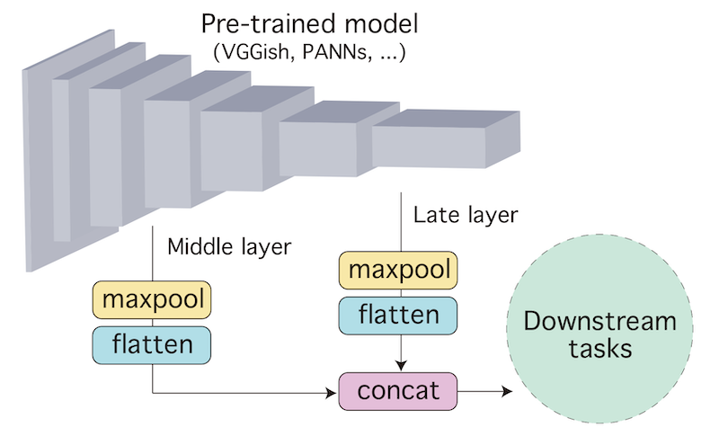
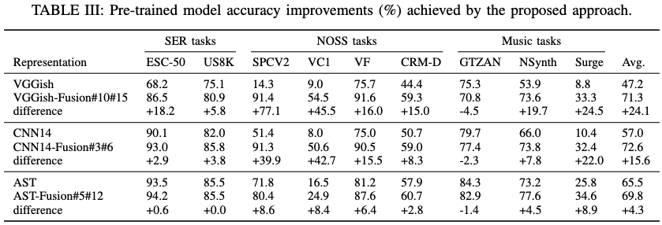

# Composing General Audio Representation by Fusing Multilayer Features of a Pre-trained Model

This repository offers implementation of our paper "Composing General Audio Representation by Fusing Multilayer Features of a Pre-trained Model."

The VGGish-Fusion and CNN14-Fusion classes are available not only for reproduction but also for your application studies.
The command lines for reproducing all the results on the paper are also available.

If you find our study useful, please consider citing our paper. The followings are BibTeX entries for citation.

```BibTeX
@inproceedings{niizumi2022composing,
    title		= {Composing General Audio Representation by Fusing Multilayer Features of a Pre-trained Model},
    author		= {Daisuke Niizumi and Daiki Takeuchi and Yasunori Ohishi and Noboru Harada and Kunio Kashino},
    booktitle   = {2022 30th European Signal Processing Conference (EUSIPCO)},
    year        = {2022},
    url         = {https://arxiv.org/abs/2205.08138}
}
```

```BibTeX
@techreport{niizumi2022composing,
	author		= "仁泉大輔 and 竹内大起 and 大石康智 and 原田登 and 柏野邦夫",
	title		= "事前学習モデルの複数層特徴量の融合を用いた汎用音響信号表現",
	booktitle	= "信学技報 (EA2022-9)",
	volume		= "122",
	number		= "20",
	pages		= "41--45",
	month		= "May",
	year		= "2022",
    url         = {https://www.ieice.org/ken/paper/20220513BCK3/}
}
```

The following shows that the original pre-trained models (VGGish, Cnn14, and AST) improve significantly (*-Fusion) without any additinal training.



## 1. Quick Example

The following is an example of VGGish using the improved version in your application.

```python
from gp_vggish import GeneralPurposeVGGish

model = GeneralPurposeVGGish()

# Load pre-trained weights here.
# model.load_state_dict(torch.load(your_weight_file))

# Suppose x is a batch (size=32) of log mel-spectrogram of 1 second audio. This is a random sample.
x = torch.rand(32, 1, 96, 64)

# We get embeddings of [32, 8192], where dimension is 8192.
sample_level_embeddings = model(x)
# We get embeddings of [32, 8192, 6], where number of frames is 6.
frame_level_embeddings = model.encode_frames(x)
```

## 2. Setup

This repository relies on some external codes, especially our evaluation package [nttcslab/eval-audio-repr (EVAR)](https://github.com/nttcslab/eval-audio-repr).

### 2-1. Setup repository contents

```sh
echo "Preparing gp_vggish.py and gp_cnn14.py."
curl https://raw.githubusercontent.com/tcvrick/audioset-vggish-tensorflow-to-pytorch/master/vggish.py -o gp_vggish.py
patch -p1 < to_gp_vggish.patch
curl https://raw.githubusercontent.com/daisukelab/sound-clf-pytorch/master/for_evar/cnn14_decoupled.py -o gp_cnn14.py
patch -p1 < to_gp_cnn14.patch

echo "Preparing EVAR (nttcslab/eval-audio-repr)."
git clone https://github.com/nttcslab/eval-audio-repr.git evar
cd evar
curl https://raw.githubusercontent.com/daisukelab/general-learning/master/MLP/torch_mlp_clf2.py -o evar/utils/torch_mlp_clf2.py
curl https://raw.githubusercontent.com/daisukelab/sound-clf-pytorch/master/for_evar/sampler.py -o evar/sampler.py
curl https://raw.githubusercontent.com/daisukelab/sound-clf-pytorch/master/for_evar/cnn14_decoupled.py -o evar/cnn14_decoupled.py

echo "Preparing and download pre-trained weights for VGGish and AST."
cd external
git clone https://github.com/tcvrick/audioset-vggish-tensorflow-to-pytorch.git tcvrick_vggish
sed -i 's/from audioset import/from \. import/' tcvrick_vggish/audioset/vggish_input.py
wget https://github.com/tcvrick/audioset-vggish-tensorflow-to-pytorch/releases/download/v0.1/pytorch_vggish.zip
unzip pytorch_vggish.zip
cd ..
cd external/
git clone https://github.com/YuanGongND/ast.git
patch -p1 < ast_models.patch
pip install wget
cd ..

echo "Adding VGGish, CNN14, and AST extensions to the EVAR folder."
sed -i 's/import evar.ar_cnn14/import evar.ar_cnn14, evar.ar_cnn14_ext/' lineareval.py
sed -i 's/import evar.ar_vggish/import evar.ar_vggish, evar.ar_vggish_ext/' lineareval.py
sed -i 's/import evar.ar_ast/import evar.ar_ast, evar.ar_ast_ext/' lineareval.py
ln -s ../../gp_cnn14.py evar
ln -s ../../gp_vggish.py evar
ln -s ../../cnn14_decoupled.py evar
ln -s ../../to_evar/evar/ar_ast_ext.py evar
ln -s ../../to_evar/evar/ar_cnn14_ext.py evar
ln -s ../../to_evar/evar/ar_vggish_ext.py evar
ln -s ../../to_evar/config/cnn14_fusion.yaml config
ln -s ../../to_evar/config/ast_fusion.yaml config
ln -s ../../to_evar/config/vggish_fusion.yaml config
ln -s ../../to_evar/config/vggish_fusion919.yaml config
cd ..
```

### 2-2. Setup data

You need copies of datasets for evaluating models.

See EVAR documents, `evar/README.md`, and `evar/Preparing-datasets.md` for more information.

## 3. Fusion Model Implementation

The followings describe the implementation of the three fusion models reported in the paper.

### 3-1. VGGish-Fusion

VGGish-Fusion is implemented as a class GeneralPurposeVGGish in `gp_vggish.py`.
It has an extra parameter, `layers`, to specify which layers to fuse.
The `layers` takes a list that enumerates the index of layers.
In our paper, we used ReLU layer outputs from `[1, 4, 7, 9, 12, 14, 17, 19, 21]`.

The pre-trained weight will be loaded in the class `AR_VGGish` (evar/evar/ar_vggish.py),
via the fusion wrapper class `AR_VGGish_Fusion` (to_evar/evar/ar_vggish_ext.py).

For converting raw audio to the log-mel spectrogram for VGGish input, you can find an implementation of the `to_audio_features` member function of the `AR_VGGish` class.

### 3-2. Cnn14 fusion model

CNN14-Fusion is implemented as a class GeneralPurposeCnn14 in [gp_cnn14.py](gp_cnn14.py).
It has an extra parameter, `layers`, to specify which network blocks to fuse.
The `layers` takes a list that enumerates the index of blocks.
Available indexes are 1 to 6.
In our paper, we used `[3, 6]`.

The pre-trained weight (https://zenodo.org/record/3987831/files/Cnn14_16k_mAP%3D0.438.pth) will be downloaded and loaded in the class `AR_Cnn14` (evar/evar/ar_cnn14.py),
via the fusion wrapper class `AR_Cnn14_Fusion` (to_evar/evar/ar_cnn14_ext.py).

For converting raw audio to the log-mel spectrogram for Cnn14 input, you can find an implementation of the `feature_extractor` member of the `AR_Cnn14` class.

### 3-3. AST fusion model

AST-Fusion is implemented in a class `AR_AST_Fusion` in `ar_ast_ext.py`.
You can specify layers to fuse in `ast_layers` in the configuration file `ast_fusion.yaml`.
In our paper, we used `[4, 11]`.

The pre-trained weight will be downloaded and loaded in the same fashion as the original [AST](https://github.com/YuanGongND/ast) implementation.
We use a wrapper class `AR_AST_Fusion` (to_evar/evar/ar_ast_ext.py).

## 4. Reproducing Paper

For reproducing results in the paper, use the command lines in [CommandLines.md](CommandLines.md).

You will need to setup all the models and datasets in your copy of [EVAR](https://github.com/nttcslab/eval-audio-repr).
See EVAR documents, `evar/README.md`, `evar/Preparing-models.md`, and `evar/Preparing-datasets.md` for more information.

If you could successfully prepare all the stuff, the following example to test Cnn14-Fusion on the CREMA-D will result in an accuracy of about 58~59%.

```sh
cd evar
python 2pass_lineareval.py config/cnn14_fusion.yaml cremad +name=AR_Cnn14_Fusion36
```

## License

See [LICENSE](LICENSE) for the detail.

## Acknowledgements / References

- [Q. Kong, Y. Cao, T. Iqbal, Y. Wang, W. Wang, and M. D. Plumbley, “PANNs: Large-scale pretrained audio neural networks for audiopattern recognition,” TASLP, vol. 28, pp. 2880–2894, 2020.](https://arxiv.org/abs/1912.10211)
    - https://github.com/qiuqiangkong/audioset_tagging_cnn
    - https://github.com/qiuqiangkong/panns_transfer_to_gtzan
- [S. Hershey, S. Chaudhuri, D. P. W. Ellis, J. F. Gemmeke, A. Jansen, R. C. Moore, M. Plakal, D. Platt, R. A. Saurous, B. Seybold, M. Slaney, R. Weiss, and K. Wilson, “CNN architectures for largescale audio classification,” in ICASSP, 2017, pp. 131–135](https://arxiv.org/abs/1609.09430)
    - https://github.com/tcvrick/audioset-vggish-tensorflow-to-pytorch
- [Y. Gong, Y.-A. Chung, and J. Glass, “AST: Audio Spectrogram Transformer,” Interspeech 2021, Aug 2021.](https://arxiv.org/abs/2104.01778)
    - https://github.com/YuanGongND/ast
